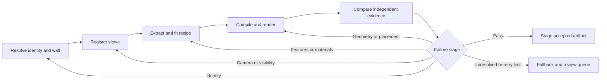

# Amsterdam gameplay map — reconstruction plan

Updated 2026-09-05 after auditing `feat/amsterdam-facade-rebuild` at `683d06b`
and the five untracked external-identity files. This is the single forward plan
for building identity, appearance, geometry and validation. The game work board
is [TODO.md](public/canal-drive/TODO.md); commands live in
[EXTRACT_PIPELINE.md](public/canal-drive/EXTRACT_PIPELINE.md).

## Outcome and priorities

Build a **low-poly, mostly correct Amsterdam that players can navigate by real
landmarks**. Prioritise location, street-facing orientation, footprint, relative
height, roof/gable silhouette, opening rhythm and distinctive colour. Small
ornament and photographic texture are optional. A recognisable building in the
wrong polygon is a failure; simplified ornament is an acceptable gameplay asset.

Keep the complete city as fallback. Improve a few verified buildings all the
way into the game, then a contiguous block and a landmark route. Every milestone
must produce a render or a measurable reduction in a named failure. Surveying
200 buildings, training several models, completing a Blender library and
photorealism are not prerequisites for rendering.

This replaces the former phase/checkpoint stop instructions. Camera tests,
candidate generation and rendering of known geometry can proceed immediately.
Accepting building evidence still requires an actual, version-bound check;
old unchecked crops do not become trusted because the plan changed.

## What the audit establishes

| Component | Keep | Gap to close |
| --- | --- | --- |
| Complete city | Published index: 342,993 features, 295 tiles, 15,357,833 gzip bytes | Features are not unique buildings or proof of current visibility |
| Identity | [bagIdentity.ts](src/canalRecall/facade/bagIdentity.ts): pand → VBO → all addresses | Persistent join to OSM polygons, building groups and game IDs |
| Elevations | [elevations.ts](src/canalRecall/facade/elevations.ts): canonical rings, collinear merging, stable wall IDs | Candidate scores are heuristics; the review builder selects its one wall by reproducing recorded distance/angle |
| OSM ownership | [buildingLadder.ts](src/canalRecall/buildingLadder.ts), [buildingComposition.ts](src/canalRecall/buildingComposition.ts): useful parts and duplicate suppression | Centroid containment is not identity certification. The façade OSM adapter requests tags/centres and associates unreferenced parts with a centre within 40 m |
| Registration | Review desk, raw panorama cache, 16 candidates | Local exported fixtures have **1 panorama, 0 anchors, 0 reviews**. Browser-only drafts were not audited; 15 candidates still need panoramas |
| Review integrity | [registrationGold.ts](src/canalRecall/facade/registrationGold.ts): solo review | An earlier acceptance survives a later rejection. Acceptance is not bound to wall/source versions. Pixel anchors lack corresponding world coordinates |
| Camera | [rectify.ts](src/canalRecall/facade/rectify.ts): metric wall resampling | Still defaults to `centre`; historical yaw claims conflict. `missingFraction` detects neither occlusion nor a wrong target |
| Dimensions | Source adapters and [buildRecord.ts](src/canalRecall/facade/buildRecord.ts) | `b3_h_dak_50p` is named `eavesHeight`; rectangle short side is treated as façade width. Neither is generally the actual elevation dimension |
| Extraction | Detector, gable classifier, grammar proposals, materials and [calibration.ts](src/canalRecall/facade/calibration.ts) | No demonstrated held-out accuracy on certified crops. A plausible grid or agreeing models can describe the wrong house |
| External photos | Five untracked discovery/assessment files | Assessments empty; duplicate titles satisfy evidence count. License regex accepts `CC BY-NC`/`CC BY-ND` despite its intended allowlist. No npm/aggregate integration |
| Rendering | MapLibre, shared Three.js, OSM parts, signature assets and streaming | No certified façade-record → gameplay-render path. Local comparison page reported 0 resident tiles after 18 seconds under standalone Vite; diagnose before using it as baseline evidence |

TypeScript lint and 14 focused suites passed during the audit: identity,
elevations, fixture scaffolding, coordinates, boundary, record, calibration,
build-record, target selection, grammar, ladder, composition, pyramidal roof and
paint inheritance. Direct probes reproduced the review/external-evidence gaps.
These passes **do not certify image registration**. The full `check:canal`,
production build, gameplay route and hardware performance were not rerun for
this documentation change.

Implementation update, 2026-09-05: the first delivery slice repairs review
revocation/version binding, external evidence/license gates, height/frontage
semantics and six legacy consumers. The comparison's missing initial camera
update is fixed; loaded comparison and gameplay captures are reproducible with
`capture:facade-baseline`. `check:facade-rebuild` is wired into `check:canal`.
The full offline aggregate, production build and focused browser regressions
pass. These are structural/render-baseline results: real accepted observations
remain at zero. Current commands and capture details are in
[EXTRACT_PIPELINE.md](public/canal-drive/EXTRACT_PIPELINE.md#building-reconstruction-workbench).

The height issue is semantic: 3DBAG documents roof percentiles as roof-surface
elevations, not eaves. Pin the source schema; derive local eaves from wall/roof
boundaries where available and retain a percentile as a percentile or explicit
approximation. An ordered pair alone does not prove correct eaves/ridge meaning.
See [3DBAG layers](https://docs.3dbag.nl/en/schema/layers/) and
[attributes](https://docs.3dbag.nl/en/schema/attributes/).

## One dossier, separate stage decisions

BAG pand IDs identify Dutch registry buildings. Add `buildingGroupId` for a
landmark/composition spanning panden. Preserve OSM way/relation/part IDs and game
POI IDs as aliases. An OSM-only building gets a namespaced OSM identity. A pand
can have multiple elevations; an elevation can contain multiple visible façade
segments. Do not force any of these into one building = one address = one wall.

Extend existing typed modules with these artifacts:

| Artifact | Required contents |
| --- | --- |
| Identity join | BAG IDs/addresses, OSM IDs/versions/roles, groups, polygons with holes, candidates/alternatives, decision/reason |
| Registered observation | Building/group, elevation/segment, source hash/date, camera model/pose/datum, world↔pixel anchors and uncertainty, residuals, visibility masks, verdict |
| Feature evidence | Value or unknown, units, elevation coordinates, supporting masks/anchors, observations, extractor version, calibrated confidence, review state |
| Building recipe | Resolved footprint/parts/roof, per-elevation openings/gable profile, materials, evidence references, simplification decisions, LOD settings |
| Compiled asset | Mesh/tile hash, local origin/transform, per-mesh IDs/aliases, bounds, collision footprint, budgets, recipe hash |
| Evaluation | Reference views/labels, diagnostic renders, separate identity/geometry/appearance metrics, regressions, corrections and disposition |

Keep raw observations, fitted recipes and rendered artifacts separate. Per field,
record `observed`, `inferred`, `authored` or `unknown`, independently of
`proposed/accepted/rejected/stale`. A twelve-vertex approximation of an observed
bell gable is legitimate; choosing its type randomly from the building ID is
not evidence. Unobserved walls can remain conservative massing. Existing theme
fallbacks remain explicitly inferred, never counted as successful extraction.

Hash dependencies per stage: source bytes/metadata/schema, identity join,
footprint/elevation, camera, rectifier/config, detector/model/prompt, review
revision, recipe/compiler and render config. Detector changes reuse valid
registration; wall changes invalidate registration and descendants. Never resume
on `pandId` alone. Keep immutable runs and a last accepted version. Timestamps
belong in manifests, not deterministic asset content.

## 1. Match the real building to its polygon and wall

1. **Resolve the entity first.** Use official [BAG linked records](https://api.pdok.nl/kadaster/bag/ogc/v2)
   to retain every VBO/address/suffix, active status and source date. A museum or
   business may occupy several buildings. Distinguish its entrance POI, building
   group and individual footprints before searching photographs.
2. **Persist an OSM↔BAG crosswalk.** Preserve full geometry and relation
   membership. Normalise `ref:bag` as a string with leading zeros; validate type
   and geometry even for exact references. Preserve outline/part membership.
   See [ref:bag](https://wiki.openstreetmap.org/wiki/Key:ref:bag) and
   [building relations](https://wiki.openstreetmap.org/wiki/Relation:building).
3. **Resolve missing/conflicting references.** Spatially index candidate
   polygons in RD metres. Compute intersection/union area, coverage both ways,
   boundary distance and orientation, respecting holes/multipolygons. Use
   addresses/names as corroboration. Store runner-up and margin; calibrate
   thresholds against reviewed examples. Proximity only discovers candidates.
   Explicitly support one-to-many/many-to-one compositions.
4. **Verify the wall separately.** Use stable elevation IDs, street/address/quay
   context and line of sight through surrounding geometry. Keep corner fronts,
   setbacks and façade segments. Scale from the selected wall length, not a
   rectangle. Survey vertices do not automatically mark visual party walls.
5. **Check spatial and visual evidence.** Show neighbouring footprints, both
   canal banks, street names, camera/rays and target wall beside the full
   panorama. Compare wall limits, readable address plaques, distinctive
   gable/entrance and neighbour order. Reliably identified external photographs
   corroborate; titles, two files, nearby cameras and duplicate images do not
   independently prove identity. Imported BAG/3DBAG tags in OSM are not another
   independent source.
6. **Emit matched, grouped, ambiguous, unmatched or stale.** Do not send
   ambiguous matches to extraction. Valid geometry can still supply fallback
   massing while appearance remains unresolved.

Start with Herengracht 270 and its opposite-bank/adjacent alternatives,
Prinsengracht 263, Huis Bartolotti, Huis met de Hoofden and Felix Meritis from
the catalog. Add Waag or Oude Kerk for multiple panden/OSM parts. Cover a corner,
narrow house, double façade, courtyard, wrong/missing `ref:bag` and OSM-only
building. Verify IDs from records rather than copying prose comments.

## 2. Register observations and extract a small useful grammar

### Camera and usable images

The named regression is pand `0363100012164989`, Herengracht 270, panorama
`TMX7316010203-001543_pano_0000_003628`. Historical standoff 38.6 m and obliquity
3.3° constrain geometry but do not identify source pixels. Keep yaw hypotheses
until independent world↔pixel correspondences resolve them. A convincing canal
house crop is insufficient.

- Export world→camera→pixel functions; require an explicit camera model at every
  call. Pin axes, handedness, yaw zero/direction, pitch/roll order, seam, image
  dimensions and vertical datum per source/mission. Inspect the municipal
  [API implementation](https://github.com/Amsterdam/panorama-api) and
  [viewer](https://github.com/Amsterdam/PanoViewer) as clues, then verify the
  actual cached mission. Do not apply an assumed global yaw fix.
- Add independent synthetic cardinal/wrap/pitch/roll fixtures and world↔pixel
  anchor tests. Round-tripping the same wrong function proves little. Anchors
  need world positions or wall-plane constraints, provenance and uncertainty;
  a clicked “eaves” pixel alone is not a 3D point.
- Audit camera ellipsoidal height versus NAP, the current 43.5 m geoid
  approximation, both RD conversion implementations and source vintages.
  Numerical projection residuals are not total geographic accuracy.
- Rank several views using source pixels/metre, full-wall coverage, obliquity,
  static/dynamic occlusion and date. Upsampling adds no evidence. Use geometry
  for intervening buildings and image masks for trees, vehicles, sky and water.
- Rectify wall plus context; export a target-only metric mask and separate
  truncation/occlusion masks. Represent multi-plane setbacks/protrusions instead
  of stretching them flat. Reserve a different usable view for validation when
  available; single-view buildings remain explicitly single-view evidence.

Repair the review desk in place: populate candidate panoramas, overlay source
pixels, include map context and import/export reviews. Remove guidance that
preselects the pictured building the reviewer should accept. The latest explicit
decision must bind to the full observation hash; source/wall changes and later
rejection revoke it. Validate reviewer/time, wall existence and source identity.
Keep identity acceptance distinct from metric registration/anchor completeness.

### Grammar, colour and texture

Use only what materially identifies the building:

- Actual footprint/parts, ground, wall top, ridge and roof planes.
- Per-elevation segments, gable type/profile, storey bands, bay positions,
  opening rectangles/types and a distinct ground floor where visible.
- Dominant wall/roof/trim colours, material family and major identifying
  features such as cornice, entrance, hoist beam or dormer.

Preserve exceptions; shops, asymmetry and double houses need more than a global
window grid. Start with manually corrected recipes for 3–5 buildings so the
representation and renderer can be tested independently of a detector. Then
compare the handcrafted extractor with **one** suitable licensed segmentation/
detection baseline on the same certified images. Add a model or fine-tuning
only for a measured failure class. Record dataset/model provenance, license,
version and split; a training campaign is not a prerequisite for the first block.

Fit parameters to detected evidence with bounded constraints: positive sizes,
openings within visible wall, supported storey/bay positions. Retain raw
observations and alternate hypotheses. Priors can regularise noisy observed
positions; they cannot make a hidden opening or guessed gable measured.
Heritage text can support a named feature after verifying the building and
possible alterations since the description.

Sample wall, trim, frames, glass and roof separately. Mask shadows, reflections,
vegetation, occluders and clipped highlights; compare stable regions across
views/dates. Camera RGB is not intrinsic surface colour. Record observed colour,
uncertainty and its deliberate mapping to a small game palette; evaluate under
neutral lighting. Use pinned aerial products/semantic roof planes for roofs.
DSM and orthophoto can share upstream imagery, so agreement is not automatically
independent. Two vision models also measure agreement, not accuracy.

Start with flat palette materials. Add a small licensed, metre-scaled brick/
stone/tile atlas only if a gameplay A/B comparison improves recognition without
aliasing or excess memory. Material class, colour and texture-asset choice are
separate. Ordinary buildings do not require extraction of exact brick bond.
Do not bake panorama lighting, trees, people or neighbours into façades. Keep
source pixels in ignored caches under their source policies and track rights
separately for viewing, extraction, training and redistribution.

## 3. Compile and verify in the real map

Extend the MapLibre custom-layer/shared-Three.js path. The first compiler can
emit recipe JSON and merged/instanced geometry; choose tiled GLB or another
format after measuring the block. Reuse signature assets/placement code where
sound. No second map engine or monolithic city mesh is required.

1. Preserve footprints, courtyards, passages and significant OSM parts. Simplify
   roof planes without flattening towers or gables; compare manual topology
   before choosing 3DBAG. Retain uncertain heights and source dates.
2. Compile each wall in its metric frame. Use opening quads/shallow recesses,
   few-vertex gable silhouettes and conservative closed side/rear volumes.
   Ordinary houses need no modelled bricks, interiors or hidden ornament.
3. Explicitly transform metres to world coordinates using ground datum and
   frontage axes. A minimum rectangle's 180° ambiguity must not choose a
   landmark entrance direction. Use the same identity/recipe across LODs.
4. Resolve one owner per building **or composition group**. Suppress only
   aliased fallback features after replacement loads; restore on failure or
   eviction. Preserve picking, highlighting, road/water depth and context-loss
   recovery. Simple footprint colliders retain passages/courtyards; windows
   should not affect driving.
5. Render orthographic façade, registered source-camera and fixed gameplay
   views. Export target IDs, depth, surface classes and unlit colour alongside
   beauty images. Include neighbours in boundary/occlusion checks so a beautiful
   wrong house cannot pass in isolation.

Use a modest authored mesh for landmarks that exceed the grammar, with the
same identity/evidence/evaluation. Prioritise Westerkerk and the canal fixtures
for the first route, then Waag, Oude Kerk, Palace, Rijksmuseum and Centraal as
navigation needs dictate. A signature model still requires correct placement.

## The self-correcting loop



Implement a reproducible runner under `scripts/facade-rebuild/`, with fixed
input manifest, targets, seed, evaluation set and cost/retry limits. Proposed
interface, **not an existing npm command**:

```text
facade:iterate --targets=<fixture-list> --offline --max-attempts=3
  -> manifest + per-building dossiers + renders + report.json/html
```

| Failure | Diagnostic evidence | Bounded correction |
| --- | --- | --- |
| Wrong house/bank/OSM alias | References, footprints, neighbour order, address evidence | Retry identity/wall; invalidate descendants |
| Anchors shift together | Independent residuals across buildings in one mission | Revisit camera/pose/datum within documented bounds; test unused anchors |
| One view fails | Occlusion/coverage masks and alternate views | Replace view or accept only supported fields |
| Local gable/opening mismatch | Corrected labels, spare view, silhouette/opening diagnostics | Refit affected parameters, revise mask/detector or request a targeted correction |
| Recipe right, mesh wrong | Diagnostic views, IDs, dimensions and transform checks | Repair compiler, UV scale, winding, placement or ownership |
| Colour wrong, geometry right | Masked neutral-colour pass and multiple observations | Revisit sampling/exposure/palette, without moving geometry |
| Render too expensive | Route traces, triangles, draw calls, memory and decode counters | Simplify/instance/atlas or reduce detail radius while preserving silhouette |

Run cheap structural checks first, identify the earliest implicated stage and
retain the previous best candidate. Change a bounded parameter group per attempt.
An LLM critic may propose structured discrepancies with evidence; it cannot
approve itself, alter identities or invent hidden geometry. Evaluate clean inputs
before revealing previous conclusions to reduce confirmation bias.

Accept a revision only if hard gates pass, its declared discrepancy improves
and named regressions remain sound. Start with three attempts per building plus
configured time/API limits. Plateau, oscillation or conflicting evidence ends in
`needs-review` and fallback. Save changes, before/after renders, scores and
reasons; resume only unchanged dependencies. A prettier image cannot compensate
for wrong identity, stale evidence or loss of a landmark feature.

Human correction should be small: choose the polygon/wall, move anchors, fix an
opening mask or select a gable/material. One auditable reviewer is sufficient
for an initial fixture. Corrections become versioned regression cases and may
enter development/training data. Separate frozen holdouts by building, block
and mission; keep all views of a building in the same split. Use a spare view
for per-building fit validation, and frozen holdouts only at release checkpoints.
Once a held-out case drives a fix, move it to development and obtain fresh blind
evaluation before claiming generalisation. Never train on your own accepted
predictions as though they were independent truth.

The achievable automation is **detect errors, retry within limits, abstain**.
It cannot recover an unseen façade or guarantee that agreeing models are right.
Audit random accepted buildings alongside prominent/uncertain/disagreeing cases.
Track rejected and unknown coverage so rejecting everything cannot look successful.

## Acceptance measurements

These are initial targets, not achieved results. Freeze target sets, masks and
threshold meanings before comparison. Report denominators/distributions and
confidence intervals; zero errors in a small sample does not prove citywide safety.

| Layer | Initial gate |
| --- | --- |
| Identity | Zero known wrong building/group/wall assignments in accepted pilot assets; all mesh IDs resolve to recorded aliases; ambiguity explicit |
| Registration | No unexplained sign/180° error. Independent visible anchors: median wall-plane error ≤0.25 m, p95 ≤0.50 m; report source/anchor uncertainty rather than unsupported precision |
| Extraction | Labelled visible regions: opening precision ≥95%, recall ≥85%, median centre error ≤0.25 m. Report exact storey/bay counts and gable class separately; unknown is not a correct negative |
| Recipe → mesh | Correct IDs, dimensions, ground heights, front direction and openings within declared simplification tolerance; no escaped openings, missing surfaces, duplicate owners or filled passages |
| Visual fidelity | Target silhouette IoU ≥0.90 on evaluable source-view boundaries; report local gable/roof edge error separately, initially p95 ≤0.50 m. Landmark checklist covers distinctive parts |
| Appearance | Initial ≥90% accepted dominant palette/material agreement against corrected labels, with confusion matrices. Report masked perceptual colour error separately; no universal raw-RGB cutoff |
| Gameplay | Fixed near/far/bridge/corner views retain recognition and clearance; picking/fallback survive failure, eviction and reload |
| Performance | Pin device/browser/resolution. Initial route p95 frame time ≤16.7 ms on development desktop, ≤33.3 ms on selected mobile hardware; hardware checks remain outstanding |

Start ordinary detailed houses around 200–1,500 triangles, signature models
around 5k–20k, then measure. Provisional building-layer ceilings: 500k visible
triangles, 150 draw calls, 64 MiB resident textures and 5 MB compressed incremental
assets for the first block. GPU budgets include baseline plus additions. Record
cold-load/decode stalls and warm frame times. Reduce detail/radius before wider
rollout if needed; these are constraints to validate, not current measurements.

Report quality and delivery together: unique pand/groups, buildings observed,
elevations registered, per-field observed/inferred/unknown coverage, acceptance
rate, error by façade/mission/occlusion, time/cost per accepted building, review
burden, bytes and frame time. Keep the fallback city complete without counting
it as successful façade reconstruction.

## Delivery order and next implementation slice

1. **Repair trust and establish the rendered baseline.** Add meaningful
   regressions for acceptance after rejection/source changes, invalid wall IDs,
   duplicate evidence and exact license matching; repair those gates. Separate
   roof percentiles from eaves and frontage width from rectangle width. Make
   legacy measurement/export entrypoints reject quarantined/stale inputs.
   Diagnose the comparison page's zero-tile state and capture the loaded city
   in gameplay. Preserve and deliberately finish/simplify the five untracked
   external-identity files; they are not completed integration.
2. **Three to five complete buildings.** Persist OSM↔BAG matches, explicit
   camera model and world↔pixel anchors for Herengracht 270 plus contrasting
   cases. Implement the minimal recipe compiler/diagnostic views using corrected
   recipes. Deliver dossiers and gameplay before/after images, including a
   deliberately wrong-building case that the gate rejects.
3. **Iteration on the 16-building catalog.** Supply missing views, benchmark
   two extraction paths, implement failure-directed retries and review import.
   Split development/blind buildings and expand missing conditions. Demonstrate
   one correction improving the rendered result and one unresolved case falling
   back. Do not report an unreviewed catalog as a gold set.
4. **One contiguous block, roughly 20–40 buildings.** Select from verified
   visibility and existing pilot geometry. Include both banks, a bridge, a
   corner and ordinary houses; report exclusions. Verify neighbour order,
   skyline, LOD transitions, collisions, bytes and gameplay performance. The
   inherited 0.873 km² boundary is a later envelope. Historical “88.6% frontal
   coverage” is only geometric candidate coverage until image identity and
   occlusion are remeasured.
5. **A landmark route, then more Amsterdam.** Connect canal houses to Westerkerk
   and further landmarks by navigation value and visible error. Expand by
   block/neighbourhood with complete fallback and blind release audits. Increase
   training/acquisition only when a measured bottleneck warrants it.

As implemented, wire identity join, camera/registration, lineage/revocation,
recipe/mesh and named visual regressions into a focused aggregate and then
`check:canal`. Keep offline checks separate from network/model acquisition.
Produce versioned staging, per-building diffs and evaluation manifests; retain
the previous accepted extract for rollback.

## Documentation and retained evidence

This consolidates the former façade-twin prompt, renderer/LOD plans, enrichment
plans, colour/RGB experiments, reconnaissance report and checkpoint. Full
historical text is recoverable with
`rtk git show 683d06b:public/canal-drive/<filename>`. Old source comments naming
those documents refer to historical design, not additional active plans.

Keep code, raw caches, structured fixtures, attribution/license files,
game/deployment docs and operational runbooks. The
[invalidation record](src/canalRecall/facade/fixtures/street-derived-invalidation.json)
and `.cache/facade-rebuild/raw/v1/manifest.json` retain quarantine and raw lineage.
Roof/RGB pilots remain optional diagnostics. Citywide roof sampling, material
fine-tuning, photographic façades, exhaustive ornament, new renderer frameworks
and unrelated-city expansion wait for a measured gameplay need.
