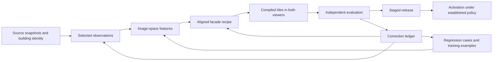

**City reconstruction: project review and delivery guide — 13 September 2026**

The project has enough infrastructure to build a recognizable, progressively detailed Amsterdam. The next investment should make that infrastructure produce repeatable, evaluated improvements. Keep the source geometry, shared façade compiler, cached observations, resumable jobs and immutable releases. Concentrate new work on image-to-building alignment, a usable correction workbench, independent evaluation and reliable delivery into the game.

The central product objective is **recognizable streets at gameplay scale**: correct location, building proportions, roof/gable silhouette, major colour regions, opening rhythm, entrances and distinctive features. This supports the geographic-learning objective in [PRODUCT.md](PRODUCT.md). Detailed joinery has lower priority than a missing balcony, wrong roofline or façade attached to the wrong wall.

This review is the current high-level delivery guide. [AMSTERDAM_FACADE_REBUILD_PLAN.md](AMSTERDAM_FACADE_REBUILD_PLAN.md) remains the detailed identity/registration design; [TODO.md](public/canal-drive/TODO.md) is the unfinished-work board. Earlier experiment reports are evidence about their own runs. Their budgets, release status and instructions should not be interpreted as the current project state.

**What exists today is substantial, but its different coverage counts need separate meanings.** These figures were checked against local artifacts, including uncommitted work, at HEAD 81f3932. The starting worktree had 47 modified and 62 untracked status entries; directory entries can contain many files. A fresh checkout of that commit will not reproduce this workspace.

| Layer | Evidence in this workspace | Assessment |
| --- | --- | --- |
| Complete-city fallback | [Amsterdam building index](public/data/extracts/amsterdam/building-tiles/index-z14.json): 342,993 features, 295 tiles, 15.36 MB gzip | Useful massing foundation. Features are not a census of unique municipal buildings or visible façades. |
| Active district release | [current.json](public/data/city-expansion/current.json), release c4bebc1f…: 7,395 buildings; 966 within Da Costabuurt boundaries, 3,189 in Jordaan, 3,240 in acquisition halos | Real district integration, with source roofs, context and a connected route. Surrounding geometry is explicitly counted. |
| Active route appearance | [District evaluation](public/data/city-expansion/evaluations/c4bebc1fcc1ad9622ea4972755b3eee69f037928db4573219c86d2c4e088920d/evaluation.json): 585/598 eligible frontages processed, 96.4% of eligible frontage length; 560 source-wall-bound frontages | Useful reversible machine observations. Excludes missing-candidate length; 25 processed frontages fail wall binding. Processing coverage does not establish visual correctness. |
| Richer development work | [Repair progress](scripts/review/REPAIR_PROGRESS.md), [retail readiness](scripts/review/retail-stage-readiness.md): source/render comparisons, 28 reviewed replacement cases, architectural corrections and dated source alternatives | Valuable development material. User notes, agent annotations, model predictions and measured references have different evidential roles. |
| Latest large preview | [Thousand-building report](scripts/review/THOUSAND_BUILDING_REPORT.md), candidate 0f625ffc…: 1,009 buildings attempted; 1,000 valid ground analyses; 988 valid full analyses; 991 descriptions attached; 12,104 compiled observed feature identities across 973 buildings | A throughput and integration experiment. The candidate has 7,580 context buildings, remains staged, and has zero accepted metric registrations. Compiled “observed” identities mean source-derived proposals, not accepted truth. |
| Automated quality machinery | Source hashes, revocations, budget reservations, invalidation, opening matching, runtime captures and release evaluation | Much of the machinery exists. There is no demonstrated end-to-end, unattended photographic-fidelity pass. |
| Local vision | Grounding DINO/SAM experiments, constrained opening fitting, appearance heuristics, MobileNet router, local VLM benchmarks | Reusable tools with small development measurements. None establishes general Amsterdam accuracy. |

The active pointer hash was e90a376c219d3a35ff965ffbdb181023fe5100a0bb785450d9ca0c2d35b449d9. The staged candidate is 0f625ffc9c7929619629fc2f61019ec8a14cbf4e6427ca3383c015c23fb998d9. Always identify which release a statement or screenshot describes.

**The main source of interrupted progress is the gap between extraction, representation and delivery.** Better image analysis cannot fix every failure:

- Registration remains unresolved. Source bytes and a plausible crop do not prove building identity, orientation, vertical datum or metric alignment. The newer registration module prepares transforms and checks supplied evidence; it does not itself recover and certify missing alignment.
- Architectural simplification sometimes removes the building's identity. I inspected the saved source/render pairs for Rozengracht 214 and the modern apartment case in the [final gallery manifest](scripts/review/thousand-building-frontage-gallery-final.json). The first retains some window rhythm but loses the stepped top and much of the contrasting masonry; the second loses projecting balconies and substantial façade structure. These are two development examples, not a measured failure rate.
- Full and ground photographs can describe different years, tenants and planes. Merging them requires field-specific temporal rules and geometry, especially for recessed entries and projecting balconies.
- A shared compiler does not guarantee identical results in both viewers. The latest [game smoke failure](.cache/city-appearance/thousand-building-game-smoke/0f625ffc9c7929619629fc2f61019ec8a14cbf4e6427ca3383c015c23fb998d9-final-maplibre-sign-tile/failure.json) reports that the Moeders sign tile did not become resident. Isolated sign rendering therefore does not establish game delivery.
- State is spread across plans, local caches, previews and release reports. Some fidelity reports still describe zero analyses and a $5 cumulative ceiling, while the later preview has completed thousands of tier requests under a separately recorded authorization. Those reports are historical snapshots.

There is also a useful fresh test finding: **test:facade-fidelity currently fails** at its assertion that no window priors are emitted. A direct fixture probe finds 24 procedural window patches at heights 4.14–9.72 and the observed door at 0.43–3.07, with only a ground source present. This is a contract/test mismatch about unobserved upper floors; it does not show that the registered ground was overwritten. Resolve the intended per-tier policy and test it explicitly.

**Use three delivery levels, with acceptance tied to the claim being made.** These are proposed product policies, not permission to bypass existing release checks.

| Delivery level | Contents | Required evidence |
| --- | --- | --- |
| City geometry | Correct footprints/identity, source heights and roofs, water/streets/trees, conservative materials | Source completeness, coordinate and ownership checks, geometry validity, runtime performance. |
| Recognizable street | Source-supported major colour regions, floor/bay rhythm, entrance zone, visible gable/balcony/storefront cues, simplified components | Correct building/wall, usable dated images, bounded relative placement, independently sampled visual acceptance. Inferred fills remain identifiable and reversible. |
| Measured detail | Individually fitted openings, physical signs, roof details and fine entrance assemblies | Metric registration, field-level reference measurements, uncertainty and candidate-bound fidelity checks. |

The existing default-on, unreviewed shopfront/literal-sign policy is recorded in [HISTORY.md](public/canal-drive/HISTORY.md). Preserve its provenance and revocation semantics. A new delivery-level policy should state explicitly which additional fields it permits and how it is evaluated.

The current 0.15 m registration, 5 cm contact and 90% opening precision/recall requirements describe a demanding detail milestone. They should not be the only way to measure useful street representation. Measure source-image extraction independently, then relative/metric placement, then the final game appearance. Keep all three results visible. Derive future street-level tolerances from recognition at real camera distances and source resolution; arbitrary centimetre precision is not a substitute for that experiment.

**Keep the geometry-led approach and make imagery an augmentation.** BAG supplies Dutch building identity; 3DBAG supplies building surfaces; BGT and OSM provide public-space and navigation context; panoramas supply visible appearance. Preserve source geometry and simplify a derived runtime copy. Use additional point-cloud fitting only for a documented geometry failure. 3DBAG already reconstructs LoD2.2 roof planes from AHN, and its ground-height estimate is a nearby point-cloud percentile, which helps explain why it does not automatically prove a photographed pavement contact. [3DBAG layer documentation](https://docs.3dbag.nl/en/schema/layers/).

Maintain one building dossier containing identities, elevations, observations and recipes. Keep country-specific identity/source adapters separate from reusable fitting and rendering. Extend the current typed contracts instead of starting another façade pipeline:

Each field needs its value or unknown state, evidence origin, source date/hash, relevant wall/interval, extractor version, uncertainty and disposition. Preserve original predictions alongside corrected recipes. Split stable architecture from dated tenancy and temporary awning deployment. A missing observation may use an explicit display prior where policy permits; revocation must not silently recreate the revoked feature.

**The most useful local CV work is concentrated in a few stages.** Start with the existing implementation and compare additions on the same frozen examples.

| Task | Practical method | Role and limit |
| --- | --- | --- |
| Select public-facing walls and views | Polygon adjacency, street proximity, ray casting, projected resolution, obliquity and view coverage | Cheap filtering and ranking before inference. Keep corner fronts and uncertain visibility as candidates. Geometry alone misses trees and vehicles. |
| Identify unusable crops | Blur/exposure checks, target clipping, person/vehicle/tree masks, full/ground visibility measured separately | Route to another view or unknown. A byte-valid crop is not a visual audit. |
| Improve alignment | Existing camera model and wall plane; line/vanishing-point evidence; geometric correspondences with robust fitting; manually checked anchors for ambiguous missions | Fit a bounded correction, retain residuals and independent validation anchors. Repeated windows, non-planar façades and wrong neighbouring houses can produce convincing false matches. |
| Locate openings | Existing Grounding DINO Tiny, image edges/components, row/column clustering and bounded least-squares fitting | Keep observed asymmetry. Escalate a demonstrated miss to a larger detector; use a grid only as an explicit prior. |
| Recover materials and silhouette | Masked robust colour sampling, colour regions, roofline/contour fitting; selective SAM masks | Exclude sky, glazing, shadows and occluders. A façade gable contour is distinct from the complete roof volume. |
| Describe exceptional assemblies | Cheap hosted vision for doors, shopfront semantics, arches, balconies and signs; local OCR as a targeted comparison | Typed proposals with source bounds and abstention. Do not ask a language model to supply camera calibration or unseen geometry. |
| Route and sample work | Existing frozen embeddings plus small classifiers, diversity clustering and disagreement sampling | Useful for choosing examples now. Automatic skipping requires validated exception recall and calibration. |
| Compare result with evidence | Projected feature boxes, silhouette distance, band/rhythm checks, visible-region coverage and independent source-first review | Use structural measurements suited to low-poly output. Photographic pixel similarity and model agreement are diagnostics, not truth. |

[Grounding DINO](https://github.com/IDEA-Research/GroundingDINO) provides text-conditioned detection; [SAM 2](https://github.com/facebookresearch/sam2) provides segmentation. Adding either does not certify identity or recover a missing façade plane. A feature matcher such as [LightGlue](https://github.com/cvg/LightGlue) is a bounded alignment experiment if simpler methods fail; its feature-extractor weights have their own licensing requirements.

The repository measured DINO Tiny at about 0.290 s and SAM at 0.135 s on three development images. Its two-view MobileNet encoder took about 0.110 s per façade on 19 images. Local Qwen/Gemma routing took roughly 4–6.5 s per request and had important semantic failures. These are warm, small-sample measurements, excluding acquisition/startup. The [router comparison](public/canal-drive/ROUTER_BENCHMARK_RESULTS.md) found only 1/5 storefront positives with the small trained local head. It is not ready to skip “ordinary” buildings automatically.

Use one cheap hosted baseline and the existing local detector/fitter as the initial comparison. A stronger model needs a named failure class and a measured gain. Training a model solely to save a few dollars of API usage is unlikely to pay for the engineering effort; training becomes attractive when correction labels improve quality or repeated refreshes establish a real workload.

**Costs are manageable for extraction; accepted quality and operations are not yet priced.** All following figures are USD. Historical charges are distinguished from future arithmetic.

| Workload | Measured basis | Planning implication |
| --- | --- | --- |
| Compact routing | 19-image hosted comparison: Flash-Lite extrapolates to $44.74/100,000 identical requests | About $60 with headroom for that exact routing workload. This excludes rich extraction. |
| Active district routing | Saved report: approximately $0.000772/request | About $96.50/100,000 with 25% overhead. Its image/prompt workload differs from the seed benchmark. |
| Latest richer preview | $3.563247 confirmed provider cost plus $0.015 conservatively accounted unknown charge; 1,000 valid ground and 988 valid full analyses | Approximately $358 per 100,000 similarly processed targets; about $447 with 25% headroom. This is not a cost per accepted reconstruction. |
| Local detection | 0.290 s DINO plus 0.135 s SAM on every image, extrapolated | About 11.8 compute hours/100,000 matching images. Selective masks reduce this. Electricity, utilization and sustained throughput remain unmeasured. |
| Human inspection | Assumption: 30 seconds/target | All 100,000 targets take 833 hours. A 1–5% audit takes 8.3–41.7 hours before detailed corrections. At an illustrative $50/hour, that audit costs $417–2,083. |

The live global journal accounts for **$5.384791 across 3,076 settled entries**, including the conservatively accounted charge. It records the later preview authorization and a cumulative ceiling of about $11.806544. The $3.578247 preview cost is part of that global total, not an additional amount to add again. Some older documents and the dedicated fidelity evaluator retain the preceding $5/$3 policy. Future work should bind budgets to a versioned run authorization and reconcile them across reporting and activation; do not rewrite old limits or treat budget-accounted unknowns as confirmed provider charges.

For a purely illustrative 342,993-target scenario, the richer batch rate gives roughly $1,227 before headroom or $1,534 with 25%. The city feature index does not establish that target count. Count unique public-facing elevations, image tiers and retries first. A separate routing pass is optional if the rich extractor already supplies its fields. Multiple views, uncertain registrations and repeated corrections will change this forecast.

The current direct-provider Flash-Lite price is $0.25/M input tokens and $1.50/M output tokens, including billed thinking output. Actual OpenRouter charges and image tokenization should remain the basis for this project's ledger. Provider choice, configuration and output length matter more than image-file bytes. [Google pricing](https://ai.google.dev/gemini-api/docs/pricing).

Storage and engineering need explicit budgets. This worktree currently occupies about 19 GB in .cache and 1.4 GB in public/data. The [district forecast](public/data/city-expansion/evaluations/c4bebc1fcc1ad9622ea4972755b3eee69f037928db4573219c86d2c4e088920d/amsterdam-forecast.json) extrapolates approximately 62 GB of crops and 1.68 TB of raw panoramas for its one-frontage city-index scenario. These are workload projections; panorama sharing and retention policy can change them substantially. Cache raw panoramas once by content, reuse neighbouring views, and retain accepted evidence/reproducible source references separately from disposable outputs. Publish geometry and compact recipes; serving every intermediate photograph as game content is unnecessary.

Track total cost as acquisition/compute + inference + retained storage + delivery traffic + engineering + human correction. Report dollars and human minutes per accepted frontage metre, as well as per analyzed image. Hosting egress, physical-device performance, developer/agent time and accepted-output yield have not been measured well enough to quote a total city cost.

**The review workbench should turn a short judgment into durable, executable evidence.** Consolidate the existing district gallery, repair preview, registration desk and router queue behind one building/case link. Preserve the specialized tools underneath. The current [notes service](scripts/review/README.md) already provides atomic saves, source/packet binding, conflict handling and a “Ready for fixes” state; build on it.

| Review mode | What the reviewer sees | What is saved |
| --- | --- | --- |
| Fast triage | Target highlighted in map/full panorama; source and matching render; a toggle to compare the previous release | Acceptable at intended scale, wrong building, bad source, geometry, appearance, missing feature or cannot tell; severity and affected region. Keyboard navigation, undo and reliable resume. |
| Focused correction | Full and ground views with dates, alternative views, wall overlay, previous/current geometry; synchronized crop/render zoom | Movable corners/lines/boxes, storey bands, gable polyline, feature type, missing/extra feature and protected human override. Optional prose accompanies structured corrections. |
| Independent evaluation | Frozen source-first cases, then randomized baseline/candidate views with model identity hidden | Reference features and uncertainty before proposals are shown; pairwise recognizability and acceptability after rendering. Exposure to predictions is recorded. |
| Area operations | Map of missing imagery, ambiguity, processed/attached/rendered/accepted coverage and error clusters | Prioritized work queue, batch summaries, review time and recurring failure categories. |

Source space, wall space and gameplay space must be visibly distinct. Show the exact target wall among neighbours, especially across canals. Show “upper source 2024 / ground source 2023” when applicable. Allow review of one field without endorsing the whole building. New evidence invalidates only the relevant approval. A corrected opening or rejected sign must survive recompilation and refresh.

Move human labels, corrections and immutable evaluation manifests out of disposable .cache storage into a backed-up project data location. Keep large images in a content-addressed store with manifests. The current router labels and district notes are valuable project data even though their paths contain “cache.” Confirm a clean-machine restore of one reviewed case before adopting cache cleanup.

For the first reference set, reuse the 28 reviewed cases for development and collect roughly 60–100 additional diverse façades to validate the review workflow. Reserve separate streets/buildings/panorama groups before tuning and deliberately cover apartments, shops, narrow houses, corners, non-planar fronts, poor visibility and raised entrances. These are pilot sample sizes, not statistical certification. Rebuild the held-out registry: one earlier 30-case set lost a reviewed overlap, and the large batch retired 14 inadvertently analyzed held-out buildings. An exposed test case becomes development data; it cannot regain unseen status by changing a filename.

Keep a representative random sample alongside hard cases. Estimate precision, recall, abstentions and acceptance by field and building class, with confidence intervals grouped by building/street. A 30-case queue cannot establish a very low citywide identity error rate. Evaluate the low-poly objective through blind baseline/candidate recognition at fixed street cameras, including untextured geometry and a sign-hidden condition so readable business names do not mask architectural errors.

**An unattended improvement loop should make bounded repairs and learn from correction evidence.** Much of its execution substrate already exists in [pipeline-runner.mjs](scripts/da-costa-block/pipeline-runner.mjs), [global-budget.mjs](scripts/da-costa-block/global-budget.mjs) and the fidelity materializer. The missing part is a unified failure-to-repair policy with independently measured success.

1. Freeze the area, sources, model/compiler versions, evaluation split, applicable publication policy and budget. Resume by dependency hashes. Reuse image analysis when only registration or rendering changes.
2. Run deterministic preflight and emit explicit failure categories. Missing/poor images trigger source selection; ownership/datum failures trigger alignment work; unsupported geometry triggers a conservative fallback.
3. Extract and fit only permitted fields. Keep observations, fitted hypotheses and rendered patches separate. Generate diagnostic overlays automatically.
4. Evaluate source-image extraction against references independently of metric registration. Then evaluate projected placement, visible feature coverage and runtime delivery. Count missing outputs as misses when the reference feature is visible.
5. Give an independent visual critic source images first, followed by the candidate, without the extractor's explanation. Require specific source regions and discrepancies. Treat its output as weak evidence and queue material disagreements; shared model errors remain possible.
6. Choose a failure-specific repair: cached alternate view, crop correction, bounded alignment fit, local detection/mask refinement, schema/fitter correction, or renderer/LOD fix. Allow at most two repair rounds and three alternate views initially. Escalate a bounded subset to a stronger model only for a stated question.
7. Recompile affected tiles and capture both viewers at deterministic cameras. Check expected feature IDs actually become resident and visible, along with containment, overlap, ground contact, stale evidence, disposal and resource budgets.
8. Stage an immutable candidate and compare with the previous accepted version. Promote only according to that delivery level's established policy and frozen evaluation. Keep rollback ready. If quality cannot be established, retain conservative output and queue the exception while independent jobs continue.
9. Export an unattended run report: gains/losses, coverage denominators, failures, retry/spend counts, human queue and next action. Repeated failure, unknown charges or exhausted budget stop the affected work; lack of progress must not produce unlimited retries.

Every accepted correction should produce a structured observation, a named regression and, where appropriate, a versioned training example. Retrain the small router only when enough new verified labels exist, and promote it only after a disjoint evaluation improves useful error rates. Do not turn machine agreement into human labels or train on the frozen evaluation set. Maintain a visible error taxonomy so fixes generalize beyond one address.

The scheduler also needs a fixed audit share: for example, start with 20% of review slots randomly selected from apparently successful and skipped cases, and use the rest for uncertainty, rare structures and regressions. This is a proposed sampling policy to measure and revise. Give technical determinism, semantic correctness and policy approval separate statuses; a passing hash check or a compiler-generated feature count must not close a visual issue.

**Low-poly performance needs to be measured across the complete scene.** The latest [saved runtime manifest](.cache/city-appearance/thousand-building-final-runtime/manifest.json) contains 28 desktop/emulated-phone captures with no recorded browser errors. It reports up to 9.12 MB of resident building geometry buffers plus estimated textures, excluding context/framebuffers/driver allocations. The same run records up to 1.46 million renderer-reported triangles and 399 draw calls on desktop, and 1.32 million triangles/327 draw calls in phone emulation. Browser heap readings are 662 MB and 894 MB respectively, constant across each layout's captures; these may be coarse or include retained state and require investigation rather than being treated as precise allocation measurements. Render counters can include multiple passes such as shadows.

Profile a named desktop and physical midrange phone at fixed resolution. Separate cold load, steady traversal and repeated tile eviction/rehydration. Measure p50/p95 frame time, loading stalls, draw calls, triangles by layer/pass, decoded heap, geometry buffers and textures. Reuse the existing provisional 60 fps desktop/30 fps phone objectives while establishing a defensible device-specific memory budget. The 11 MB detail gate alone cannot prove device suitability.

Simplify source meshes in derived artifacts with silhouette constraints; use instancing and palette batches for repeated windows/doors/balconies. Preserve major shape at medium distance and reserve joinery relief for close views. Ground/pavement, trees, shadows, context meshes and data parsing must share the performance budget. Allocate detail by projected screen size and navigational value, then verify both renderers consume the same intended features.

**An open-data city also needs a complete source inventory.** 3DBAG is explicitly CC BY 4.0. The government catalogue lists Amsterdam's panorama registration as CC BY 4.0, but that catalogue entry should be bound to the actual image collection/provider/vintage before treating all historical imagery alike. PDOK advises checking each dataset's metadata. [3DBAG](https://docs.3dbag.nl/en/), [panorama catalogue](https://data.overheid.nl/dataset/a6504a84-170a-4b89-910d-7df7f0e60d5a), [PDOK guidance](https://www.pdok.nl/veelgestelde-vragen-over-pdok-services).

Record license, attribution, capture/source date and allowed use per source snapshot and model checkpoint. Keep observation/training use, evidence redistribution and published texture assets distinguishable. The repository's [NOTICE.md](public/canal-drive/NOTICE.md) already identifies unresolved 3D Warehouse landmark licensing and embedded third-party material. Those optional landmarks should have an explicit replace/retain decision before describing the complete asset set as openly reusable. This does not require rebuilding the valid BAG/3DBAG/BGT foundation.

**Deliver the next work in small, complete milestones.** Effort ranges below are planning judgments for one engineer familiar with the repository, with reviewer availability; they are not measured estimates or a quote for completing Amsterdam. Registration/source limitations may change the sequence.

| Order | Bounded deliverable | Completion evidence | Indicative effort |
| --- | --- | --- | --- |
| 1 | Freeze the current working baseline; make one run registry; reconcile policy/test/budget drift and protect review data | A new session can identify active/candidate releases, reproduce one case, restore notes and run documented checks; the failing fidelity assertion is resolved against an explicit tier policy | 1–2 engineer-days |
| 2 | Consolidate triage and structured correction; establish development cases and a disjoint pilot evaluation | A reviewer corrects wrong identity, one opening, one gable and one temporal conflict; the edits survive refresh and drive a targeted rebuild | 3–5 days, plus labeling |
| 3 | Close source → recipe → both-viewer delivery on 20–40 representative façades along one route | Independent image-space scores; verified wall identity; explicit registration status; corrected silhouette/entrance/balcony cases; Moeders residency regression resolved | 4–7 days; overlaps milestone 2 |
| 4 | Wire the bounded repair loop into the existing coordinator | Repeated unattended runs resume without duplicate paid work, preserve overrides, stop unproductive repairs, report quality change and stage a reproducible candidate | 3–5 days |
| 5 | Validate representative district batches and device budgets, then expand incrementally | A 100–300-façade pilot across distinct architectural areas, a frozen evaluation, measured correction effort/accepted coverage and physical-device traversal results | 3–5 days plus review/profiling |

Allow roughly three to five engineer-weeks for this first reliable loop, subject to the uncertainties above. Use existing caches and the large preview to discover failures. Expand coverage after demonstrating that a correction improves other cases and that the final game retains the improvement. Keep a small, separately scoped path for important landmarks that need authored source-supported components.

The twelve missing original image-numbered examples remain an unresolved historical issue. Preserve their status and provenance. Scope a new pilot explicitly to identified evidence so that unrelated city work does not depend on recovering inaccessible attachments. Likewise, make reference-set size and budget policy properties of the run rather than permanent constants in the reusable evaluator.

**Future contributors can start from this map.** “Active foundation” means useful current code, not a claim that all checks pass or that every output is accepted.

| Area | Start here | How to use it |
| --- | --- | --- |
| Source acquisition and resumable orchestration | [District runbook](public/canal-drive/DISTRICT_PIPELINE.md), [district coordinator](scripts/city-appearance/run-district-pipeline.ts), [area runner](scripts/city-appearance/run-area-pipeline.ts), [source acquisition](scripts/da-costa-block/source-acquisition.mjs) | Active foundation. Extend source/area configuration and common stages. The da-costa-block directory contains reusable infrastructure despite its name. |
| Identity and camera | [bagIdentity.ts](src/canalRecall/facade/bagIdentity.ts), [elevations.ts](src/canalRecall/facade/elevations.ts), [rectify.ts](src/canalRecall/facade/rectify.ts), [registration.ts](scripts/city-appearance/fidelity/registration.ts) | Reuse canonical walls and explicit coordinate models. Add measured alignment evidence and mission-specific validation. |
| Local extraction experiments | [fit_openings.py](scripts/facade-rebuild/fit_openings.py), [photo_appearance.py](scripts/facade-rebuild/photo_appearance.py), [classifier plan](public/canal-drive/CLASSIFIER_REVIEW_PLAN.md), [router results](public/canal-drive/ROUTER_BENCHMARK_RESULTS.md) | Reuse detector/fitter experiments; treat tiny benchmark results as development evidence. |
| Rich extraction and evidence contracts | [Fidelity pipeline](scripts/city-appearance/fidelity/PIPELINE.md), [extract.mjs](scripts/city-appearance/fidelity/extract.mjs), [materialize.mjs](scripts/city-appearance/fidelity/materialize.mjs), [facadeDescription.ts](src/canalRecall/facadeDescription.ts) | Active implementation with incomplete acceptance. Keep image analysis reusable across registration changes. |
| Assembly and temporal policy | [cityAppearanceFacadeRecipes.ts](src/canalRecall/cityAppearanceFacadeRecipes.ts), [facadeOpeningLayout.ts](src/canalRecall/facadeOpeningLayout.ts), [facadeTemporalEvidence.ts](src/canalRecall/facadeTemporalEvidence.ts), [facadeEntranceAssemblies.ts](src/canalRecall/facadeEntranceAssemblies.ts) | Shared feature/geometry policy. Resolve partial-source behavior here and verify both consumers. |
| Tiles, game and study viewer | [compile-block-tiles.ts](scripts/city-appearance/compile-block-tiles.ts), [cityAppearanceThree.ts](src/canalRecall/cityAppearanceThree.ts), [cityAppearanceStreamer.ts](src/canalRecall/cityAppearanceStreamer.ts), [studyFacadesBrowser.ts](src/canalRecall/studyFacadesBrowser.ts), [buildingTilesBrowser.ts](src/canalRecall/buildingTilesBrowser.ts) | Keep transport, LOD, owner identity and disposal coherent. A study render alone does not validate game integration. |
| Human corrections and large preview | [Review notes](scripts/review/README.md), [repair preview](public/canal-drive/facade-repair-preview.html), [district gallery](public/canal-drive/district-evaluation.html), [thousand-building gallery](public/canal-drive/thousand-building-review.html), [candidate report](scripts/review/thousand-building-candidate-report.json) | Current development inputs and comparison tools. Consolidate their entry points and preserve labels. |
| Publication and evaluation | [publish-area-geometry-demo.ts](scripts/city-appearance/publish-area-geometry-demo.ts), [evaluation.ts](scripts/city-appearance/fidelity/evaluation.ts), [activate.ts](scripts/city-appearance/fidelity/activate.ts) | Immutable staging and evidence-bound activation. Separate reusable mechanisms from historical milestone policy. |
| Historical designs and experiments | [Rebuild plan](AMSTERDAM_FACADE_REBUILD_PLAN.md), [city architecture plan](public/canal-drive/CITY_APPEARANCE_PLAN.md), [history](public/canal-drive/HISTORY.md), scripts/facade-twin and older grammar/photo labs | Consult for rationale and reusable algorithms. Legacy street-derived extraction is deliberately guarded/quarantined; do not revive it accidentally. |

For local navigation, the documented start command is:

    PORT=5195 npm run dev

Then use /canal-drive/district-evaluation.html for active-release comparisons, /canal-drive/facade-repair-preview.html for corrected development cases, and /canal-drive/thousand-building-review.html for the staged large preview. [EXTRACT_PIPELINE.md](public/canal-drive/EXTRACT_PIPELINE.md) documents specialized tools. No server was listening on port 5195 during this audit; visual inspection used saved, release-bound captures.

**Audit verification and limits.** Fresh checks passed: npm run lint, npm run test:district-pipeline, node scripts/check-city-pipeline.mjs, and npm run test:facade-thousand. These exercised isolated source completeness, dependency invalidation, resume/budget behavior, candidate materialization, geometry rebasing, staged-publication protection, and isolated awning/sign LOD/export. npm run test:facade-fidelity failed as described above. Existing runtime captures and two source/render pairs were inspected; a fresh production build, complete browser matrix, physical-device benchmark, held-out accuracy run and exhaustive license audit were not performed. No new paid inference or release activation was part of this review.
